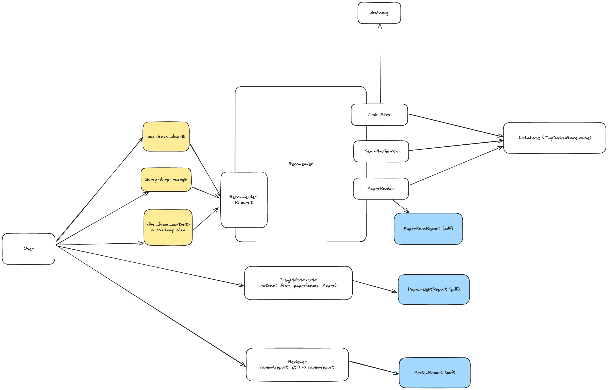

# State of the art with AI

Extract personalized insights from the state of the art in Machine Learning, AI and Computer Science.



Used to generate the [state of the art newletter](https://stateoftheartsummaries.substack.com/).


## How to use it:

Latest paper recommendations:

```sh
sota recommender generate
```

With a query to scope 

```sh
sota recommender generate -q 'my query'
```

By topic 

```sh
sota recommender generate --by_topic='my_topic'
```
